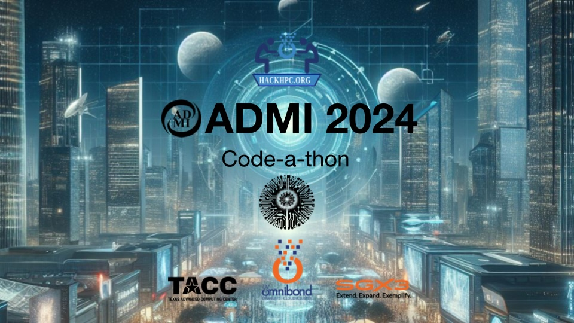

# 2024 ADMI CODEATHON COMPETITION
<i>April 4th-6th, 2024</i>

<a href="https://admiusa.org/admi2024/codeathon.php">2024 ADMI Symposium on Computing at Minority Institutions</a>

### Outputs

  * <a href="https://github.com/HackHPC/codeathonatadmi24/tree/main/assets/Teams">Team Presentations</a>
  * <a href="assets/Sample_Code_Snippets_to_Help.pdf">Sample Code Snippets (PDF)</a>
  * <a href="assets/ADMI_2024-Codeathon.pdf">Introduction Presentation (PDF)</a>
  * <a href="assets/assets/ADMI_2024-Codeathon-ThePlan.pdf">Software Engineering Extention (PDF) </a>

The Association of Computer Science Departments at Minority Institutions (ADMI) is hosting a community coding/codeathon event entitled "Take a Ride on the International Space Station (ISS)" as part of the 2024 ADMI Symposium on Computing at Minority Institutions. Join us as we delve into the realm of space exploration!

In this event, participants will collaborate to create a science gateway focused on tracking the International Space Station (ISS) and analyzing its trajectory data. The event aims to bring together coding enthusiasts, space enthusiasts, and data enthusiasts to work on a hands-on project that explores real-time space tracking and data analysis. Participants will have the opportunity to engage with open-source tools, APIs, and datasets related to the ISS and space exploration.

### Throughout the event, participants will:

  * Learn about the International Space Station (ISS) and its orbit patterns.
  * Explore available APIs and datasets for tracking the ISS in real-time.
  * Collaborate to develop a science gateway for tracking the ISS and plotting its trajectory.
  * Analyze tracking data to uncover insights about the ISS's movement and its relation to Earth.
  * Share ideas, troubleshoot challenges, and collaborate with fellow participants.

Whether you're a seasoned coder, a space enthusiast, or simply curious about exploring space data, this event offers a unique opportunity to contribute to a collaborative project while expanding your coding skills and knowledge of space science.

No coding experience necessary. Participants will attend a special prep session on Thursday evening, April 4th to get familiar with the tools used in the codeathon.
Join us for an inspiring journey into the cosmos at the Community Coding Event: Exploring Space!
